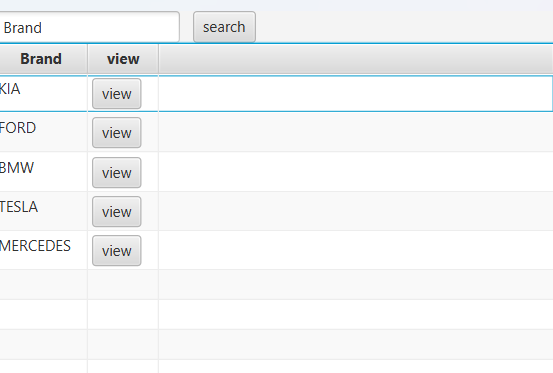
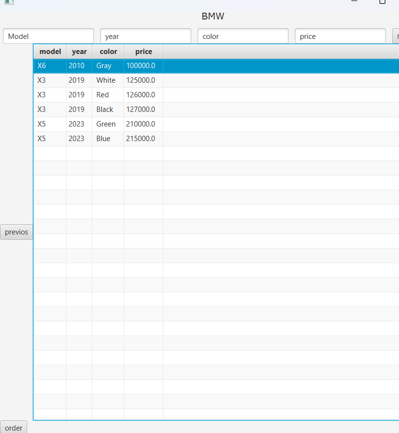
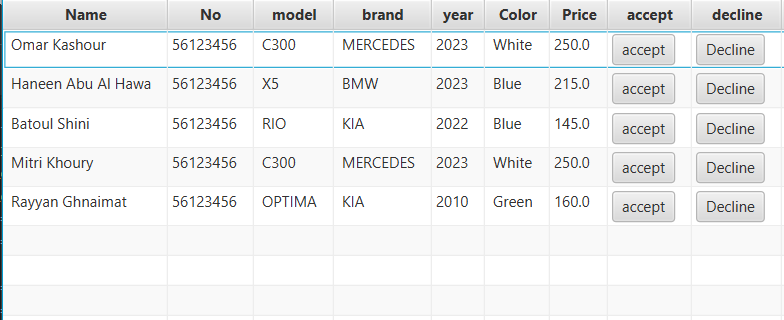
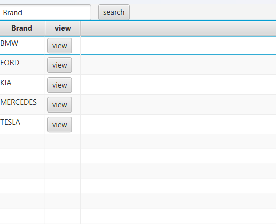

# 🚗 Car Management System


  

A desktop application for managing car brands, car information, and customer orders. Built using **Java**, **JavaFX**, and custom **linked data structures**.

---

## 📝 Features

### User Side

* View all car brands and their available cars.
* Filter/search cars by model, year, color, or price.
* Browse brands using next/previous navigation.
* Place orders for selected cars with customer information.

### Admin / Order Management

* View all customer orders in a TableView.
* Accept or decline orders.
* Completed orders are stored in a stack for history tracking.
* Pending orders are maintained in a queue for processing.

### Data Structures

* Custom **LinkedList** and **DoubleLinkedList** for storing cars and brands.
* **QueueList** for handling orders in process.
* **StackList** for finished orders.

---

## 🖼️ Screenshots


1. **User Car View**
   * Shows brand name, list of cars, and search fields.
   

2. **Place Order Form**
   * Customer name and number input, confirm button.
    

3. **Orders TableView**
   * Shows all orders with accept/decline buttons.
   

4. **User Brand TableView**
   * Shows list of brands and "View" button for each brand.
    


---

## 📁 Project Structure

```
structphase2/
├─ CarsInfo.java
├─ OrdersTableView.java
├─ UserTableView.java
├─ Orders.java
├─ Customer.java
├─ Car.java
├─ Brand.java
├─ LinkedList.java
├─ DoubleLinkedList.java
├─ QueueList.java
├─ StackList.java
├─ Node.java
├─ DoubleNode.java
└─ StartClass.java
```

---

## ⚙️ Technologies Used

* Java 17+
* JavaFX 19+
* Custom LinkedList and DoubleLinkedList
* Stack and Queue data structures
* TableView and UI components

---

## 🚀 How to Run

1. Clone the repository:

```bash
git clone https://github.com/abdallahabed/CarManagementSystem.git
```

2. Open in **IntelliJ IDEA** or **Eclipse**.
3. Run `StartClass.java` to launch the application.

---

## 📚 Learning Points

* JavaFX TableView and UI components.
* Implementing custom LinkedList, DoubleLinkedList, Stack, and Queue.
* Order management using OOP concepts.
* MVC-inspired UI and data separation.


